# ☁️ Cloud Cost Intelligence Platform


> **A production-style AWS Cloud Cost Intelligence Platform for collecting, storing, analyzing, and visualizing AWS cost data with automated anomaly detection and event-driven processing.**

---

## 📌 Overview

Cloud Cost Intelligence is a production-oriented cloud engineering capstone designed to demonstrate how a real AWS platform can combine:

* Infrastructure as Code
* Serverless and containerized workloads
* Event-driven architecture
* Relational and NoSQL storage
* AWS cost intelligence
* Automated anomaly detection
* Secure secret management
* Encryption
* Observability
* CI/CD automation
* Infrastructure validation and security scanning
* Production deployment workflows

The platform collects AWS Cost Explorer data, stores normalized cost information in MySQL, analyzes historical spending for anomalies, generates alerts, and exposes the results through a web dashboard.

The system also includes a controlled synthetic-data seeding mechanism for demonstrations where real AWS Cost Explorer data is insufficient to populate meaningful historical visualizations.

---

# 🎯 Project Goals

The project was built around several engineering goals:

* Build a realistic AWS production-style platform rather than a single-service demo.
* Use Terraform to provision the complete infrastructure.
* Combine **ECS Fargate** and **AWS Lambda** according to workload characteristics.
* Implement scheduled, event-driven cost collection.
* Persist structured cost data in Amazon RDS MySQL.
* Use DynamoDB for application event data.
* Detect unusual spending patterns.
* Deliver cost alerts through Amazon SNS.
* Serve the dashboard globally through CloudFront.
* Secure credentials with Secrets Manager and configuration with SSM Parameter Store.
* Apply encryption using KMS.
* Implement CI/CD using GitHub Actions.
* Validate infrastructure before deployment.
* Make database migrations part of the infrastructure deployment process.
* Keep demo-data generation separate from normal production deployment.

---

# 🏗️ Architecture

## Architecture at a Glance

The platform is divided into five major areas:

1. **Frontend & API**
2. **Cost Ingestion**
3. **Analytics & Alerting**
4. **Data Layer**
5. **Security, Observability & Deployment**

### High-Level Flow

```text
                         ┌──────────────────┐
                         │  User / Browser  │
                         └────────┬─────────┘
                                  │
                                  ▼
                         ┌──────────────────┐
                         │   CloudFront     │
                         └────────┬─────────┘
                                  │
                     ┌────────────┴────────────┐
                     │                         │
                     ▼                         ▼
              ┌──────────────┐          ┌──────────────┐
              │      S3      │          │     ALB      │
              │  Frontend    │          └──────┬───────┘
              └──────────────┘                 │
                                               ▼
                                      ┌─────────────────┐
                                      │   ECS Fargate   │
                                      │    cost-api     │
                                      └────────┬────────┘
                                               │
                                  ┌────────────┴────────────┐
                                  │                         │
                                  ▼                         ▼
                           ┌─────────────┐           ┌─────────────┐
                           │ RDS MySQL   │           │  DynamoDB   │
                           │ Cost Data   │           │   Events    │
                           └─────────────┘           └─────────────┘


              ┌───────────────────────────────────────────┐
              │          EVENT-DRIVEN COST PIPELINE       │
              └───────────────────────────────────────────┘

                 EventBridge
                      │
                      ▼
              Collector Lambda
                      │
                      ▼
              AWS Cost Explorer
                      │
                      ▼
                  RDS MySQL
                      │
                      ▼
             Anomaly Detector
                      │
                      ▼
                    SNS
                      │
                      ▼
                 Cost Alerts
```

> **Architecture diagram:**

> `docs/architecture/aws-architecture.png`

<p align="center">
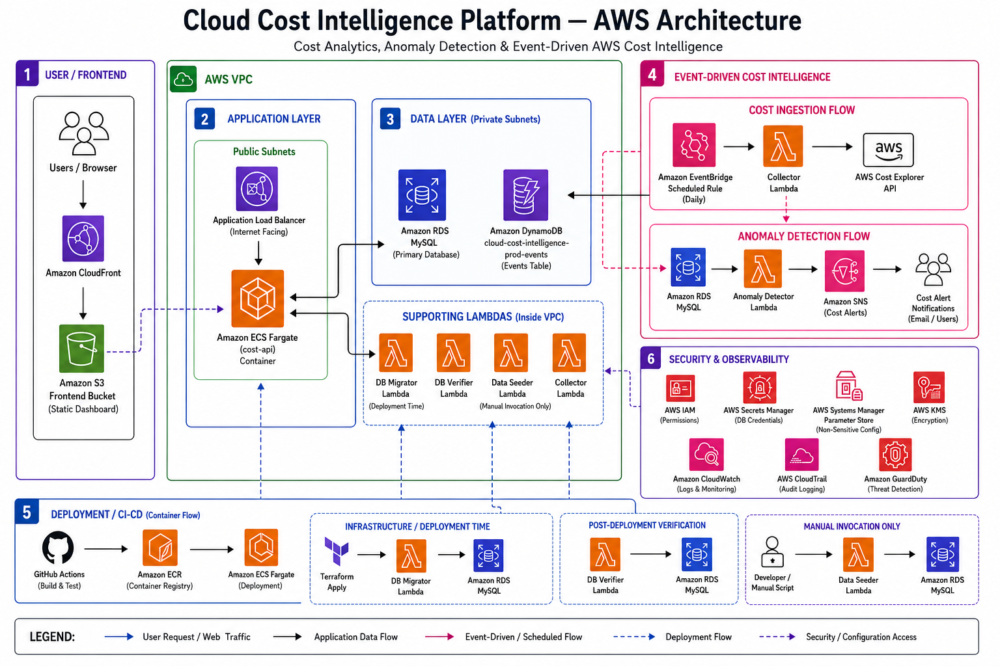
</p>

---

## Mermaid Architecture

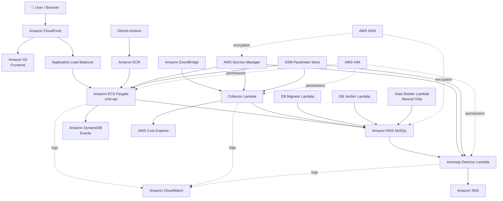

---

# ☁️ AWS Services

| Service                       | Purpose                                                              |
| ----------------------------- | -------------------------------------------------------------------- |
| **Amazon CloudFront**         | Global delivery of the dashboard                                     |
| **Amazon S3**                 | Static frontend hosting                                              |
| **Application Load Balancer** | Public API entry point                                               |
| **Amazon ECS Fargate**        | Runs the containerized Flask API                                     |
| **Amazon ECR**                | Stores API container images                                          |
| **Amazon RDS MySQL**          | Primary relational cost database                                     |
| **Amazon DynamoDB**           | Application event storage                                            |
| **AWS Lambda**                | Serverless collection, analysis, migration, verification and seeding |
| **Amazon EventBridge**        | Scheduled cost collection                                            |
| **AWS Cost Explorer**         | AWS cost and usage source                                            |
| **Amazon SNS**                | Cost anomaly notifications                                           |
| **AWS Secrets Manager**       | Secure database credentials                                          |
| **SSM Parameter Store**       | Non-sensitive database configuration                                 |
| **AWS KMS**                   | Encryption                                                           |
| **Amazon CloudWatch**         | Logs and monitoring                                                  |
| **AWS IAM**                   | Least-privilege access control                                       |
| **AWS CloudTrail**            | API/audit logging                                                    |
| **Amazon GuardDuty**          | Threat detection                                                     |
| **Amazon VPC**                | Network isolation                                                    |

---

# 🧩 Core Components

## 1. Frontend

The dashboard is a static web application hosted in Amazon S3 and delivered through Amazon CloudFront.

CloudFront provides the public entry point and global caching layer while keeping the S3 bucket private.

### Flow

```text
Browser
   ↓
CloudFront
   ↓
S3 Frontend Bucket
```

### Screenshot

<p align="center">
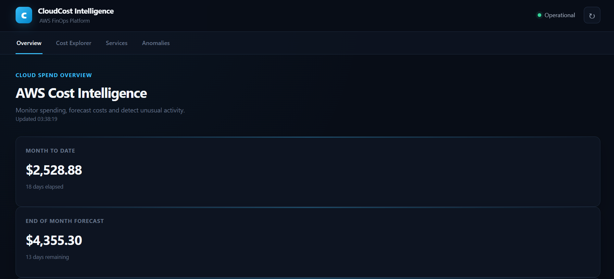
</p>
<p align="center">
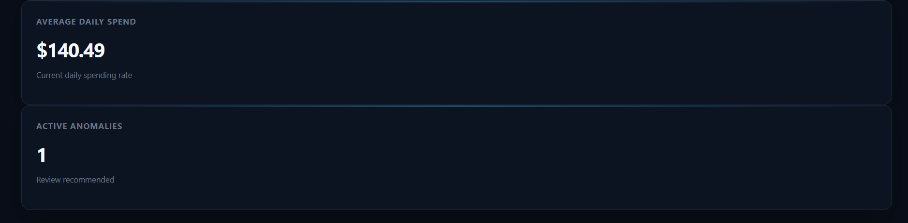
</p>
<p align="center">
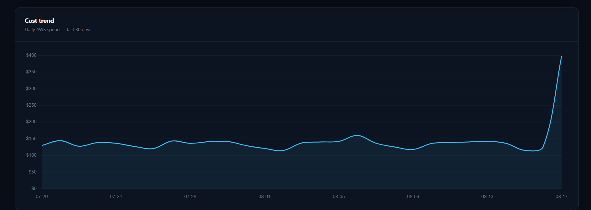
</p>
<p align="center">
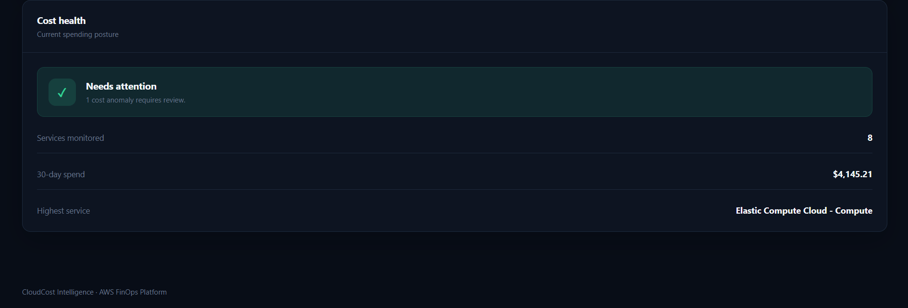
</p>

---

# 🚀 2. Containerized API

The application API is implemented as a Flask service running inside a Docker container.

```text
Internet
   ↓
Application Load Balancer
   ↓
ECS Fargate
   ↓
cost-api
   ↓
RDS / DynamoDB
```

The ECS service runs the application independently from the frontend and provides the backend API consumed by the dashboard.

### Container workflow

```text
Developer
    ↓
GitHub Actions
    ↓
Docker Build
    ↓
Amazon ECR
    ↓
ECS Fargate
```

---

# 💰 3. AWS Cost Collection

Cost ingestion is implemented as an event-driven pipeline.

Amazon EventBridge triggers the Collector Lambda according to the configured schedule.

```text
EventBridge
     ↓
Collector Lambda
     ↓
AWS Cost Explorer
     ↓
RDS MySQL
```

The collector retrieves AWS cost and usage information and persists the normalized data for later analysis and visualization.

This keeps cost ingestion independent from the API request path.

---

# 🔎 4. Anomaly Detection

Historical cost data is analyzed by a dedicated Lambda function.

```text
RDS MySQL
    ↓
Anomaly Detector Lambda
    ↓
Amazon SNS
    ↓
Cost Alert
```

This separation allows the API, ingestion pipeline, and analytical workload to evolve independently.

### Screenshot

<p align="center">
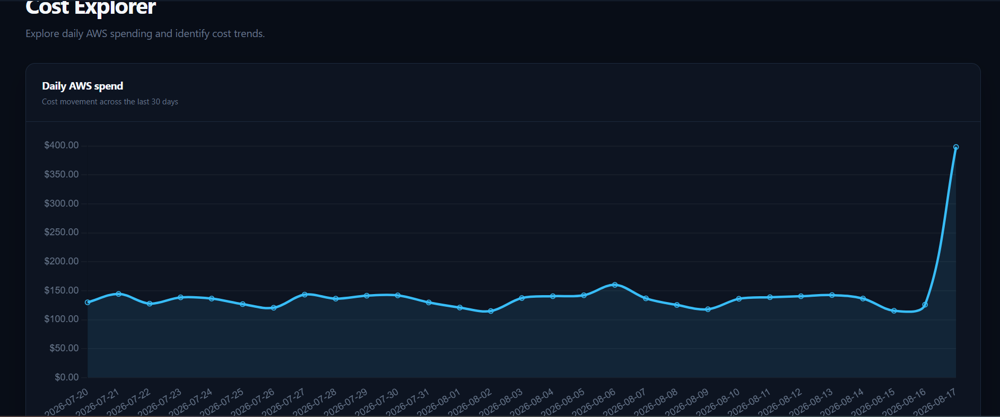
</p>
<p align="center">
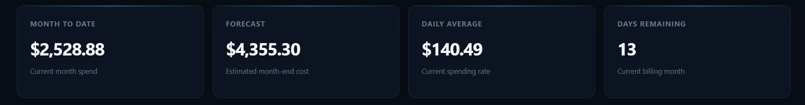
</p>
<p align="center">
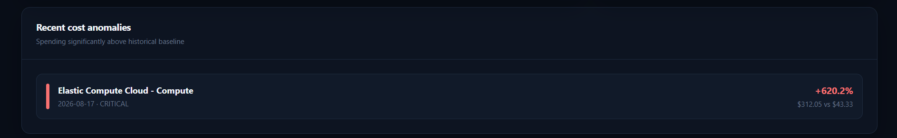
</p>
<p align="center">
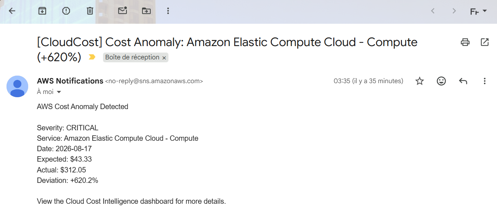
</p>

---

# 🗄️ 5. Data Layer

## Amazon RDS MySQL

RDS is the primary relational datastore for:

* cost records
* historical data
* application data
* migration-managed schema

Database migrations are executed through a dedicated Lambda during infrastructure deployment.

## Amazon DynamoDB

DynamoDB stores application event information using a serverless NoSQL model.

This demonstrates the use of both relational and NoSQL persistence according to workload requirements.

---

# 🔐 6. Security & Configuration

Security was treated as an architectural concern rather than a final checklist.

### Secrets Manager

Sensitive database credentials are stored in AWS Secrets Manager rather than hardcoded into:

* source code
* Terraform variables
* Docker images
* Lambda environment variables

### SSM Parameter Store

Non-sensitive configuration such as database connection parameters is stored separately in Parameter Store.

### KMS

KMS provides encryption capabilities for protected resources and secrets.

### IAM

Each workload receives dedicated IAM permissions based on its responsibilities.

Examples include:

* ECS execution permissions
* Lambda database access
* Secrets Manager access
* Parameter Store access
* DynamoDB access
* KMS permissions

### GuardDuty & CloudTrail

GuardDuty provides threat detection while CloudTrail provides an audit trail for AWS API activity.

---

# 📊 7. Observability

Amazon CloudWatch provides centralized observability for the application and serverless workloads.

Monitoring covers:

* Lambda execution
* API/container logs
* deployment troubleshooting
* runtime failures
* application behavior

This was particularly important during development because several production-style issues were diagnosed directly from CloudWatch logs.

### Screenshot

<p align="center">
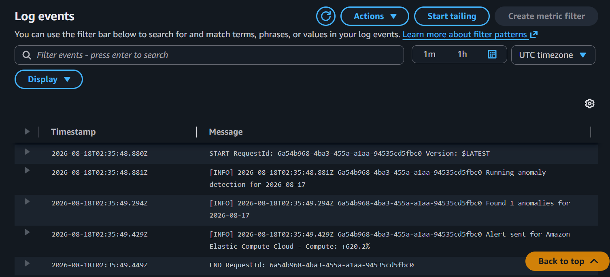
</p>

---

# 🔄 CI/CD Pipeline

The project uses GitHub Actions to automate validation and deployment.

## Continuous Integration

The CI pipeline validates the project before deployment.

It includes:

* Python formatting
* Flake8
* ShellCheck
* Dockerfile linting with Hadolint
* Terraform formatting
* Terraform validation
* TFLint
* Checkov
* security scanning
* automated tests
* Lambda package validation

The goal is to catch infrastructure, application, container, and security issues before production deployment.

---

# 🚢 Continuous Deployment

The deployment workflow is divided into explicit stages.

```text
GitHub
   │
   ▼
CI Validation
   │
   ▼
Build Lambda Packages
   │
   ▼
Terraform Init
   │
   ▼
Terraform Validate
   │
   ▼
Terraform Plan
   │
   ▼
Terraform Apply
   │
   ├───────────────┐
   ▼               ▼
Amazon ECR     Lambda Packages
   │
   ▼
ECS Deployment
   │
   ▼
Frontend → S3
   │
   ▼
CloudFront Invalidation
   │
   ▼
Smoke Tests
```

### Deployment verification

The deployment pipeline validates:

* API health endpoint
* alerts endpoint
* CloudFront availability
* frontend content
* ECS deployment
* infrastructure outputs

A successful production deployment therefore represents more than a successful `terraform apply`.

### Screenshot

<p align="center">
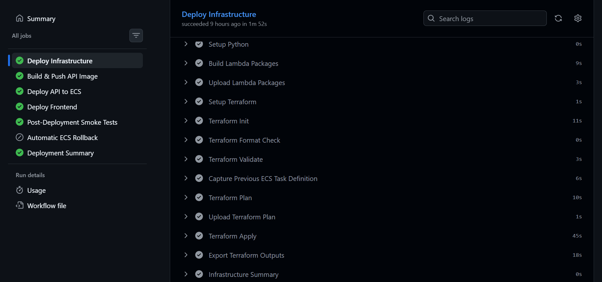
</p>

---

# 🧪 Manual Demo Data Seeding

Real AWS Cost Explorer data can be very small during development, especially on a newly created AWS environment.

To make the dashboard demonstrable without contaminating the normal deployment process, the project includes a separate synthetic data seeding workflow.

```text
Developer
    │
    ▼
scripts/seed-data.sh
    │
    ▼
Data Seeder Lambda
    │
    ▼
RDS MySQL
    │
    ▼
Dashboard
```

The Data Seeder Lambda is **not automatically executed by CI/CD**.

It is intentionally controlled through manual invocation.

The generator produces historical synthetic service-level cost data suitable for demonstrating:

* trends
* service comparisons
* historical analysis
* anomaly detection
* dashboard visualizations

This keeps demonstration data separate from the infrastructure deployment lifecycle.

---

# 🗃️ Database Migration Strategy

Database schema initialization is handled during infrastructure deployment.

```text
Terraform Apply
      ↓
DB Migrator Lambda
      ↓
RDS MySQL
      ↓
Schema / Migrations
```

A dedicated DB Verifier Lambda is also used to validate the deployed database state.

This avoids relying on a developer manually connecting to the production database after deployment.

---

# 🧠 Engineering Decisions

## Why ECS Fargate for the API?

The API is a continuously available application workload with:

* predictable HTTP traffic
* containerized application dependencies
* long-running web-server behavior

ECS Fargate provides container orchestration without requiring EC2 instance management.

## Why Lambda for cost collection?

The collector is event-driven and scheduled rather than continuously running.

Lambda therefore fits the workload naturally:

```text
Scheduled Event
      ↓
Lambda executes
      ↓
Cost Explorer
      ↓
Database
      ↓
Execution ends
```

## Why both RDS and DynamoDB?

The workloads have different persistence requirements.

**RDS MySQL** provides relational storage for structured cost and analytical data.

**DynamoDB** provides a simple serverless model for application events.

## Why CloudFront in front of S3?

The frontend bucket remains private while CloudFront provides the public delivery layer.

This avoids exposing the S3 bucket directly to the internet.

## Why manual synthetic data?

AWS Cost Explorer data from a small development environment can be insufficient to demonstrate a cost intelligence dashboard.

Instead of artificially modifying real AWS billing data, synthetic data is generated through an explicitly controlled demo mechanism.

---

# 🧩 Major Challenges & Solutions

This project involved significantly more than simply provisioning AWS resources.

## Challenge 1 — Designing a Hybrid ECS + Serverless Architecture

### Problem

The platform required both a persistent API and event-driven workloads.

Using Lambda for everything would have been unnecessary for the API, while using ECS for scheduled background tasks would introduce unnecessary infrastructure.

### Solution

Workloads were separated according to their execution model:

* ECS Fargate → API
* Lambda → cost collection
* Lambda → anomaly detection
* Lambda → migrations
* Lambda → database verification
* Lambda → manual demo seeding
* EventBridge → scheduling

This produced a more appropriate production-style architecture.

---

## Challenge 2 — Lambda Dependency Packaging

### Problem

Lambda functions using external Python libraries cannot rely on packages being installed locally.

The DB Migrator initially failed during Terraform deployment with:

```text
Unable to import module 'app':
No module named 'pymysql'
```

### Root Cause

The build process classified the DB Migrator as dependency-free even though it contained:

```text
PyMySQL
```

### Solution

The Lambda build system was redesigned so dependency-based functions install their requirements into the deployment package before creating the ZIP artifact.

The final package was verified to contain:

```text
app.py
pymysql/
```

without Python cache artifacts.

This made Lambda packaging deterministic and CI-compatible.

---

## Challenge 3 — Terraform Validation Before Lambda Artifacts Existed

### Problem

Terraform validation failed because:

```text
filebase64sha256(...)
```

was evaluated against Lambda ZIP files that had not yet been created.

### Solution

The CI pipeline was reordered so Lambda packages are built before Terraform validation.

```text
Build Lambda Packages
        ↓
Upload Artifact
        ↓
Terraform Validation
```

The validation job downloads the Lambda artifact before executing:

```bash
terraform validate
```

This aligned Terraform's validation requirements with the actual build lifecycle.

---

## Challenge 4 — Terraform Version Mismatch

### Problem

CI initially used Terraform `1.7.5` while the project required:

```text
~> 1.13
```

Terraform initialization therefore failed.

### Solution

The Terraform version used by CI was aligned with the project's required version constraint.

This highlighted an important CI/CD principle:

> The infrastructure toolchain must be version-controlled just like the application runtime.

---

## Challenge 5 — Docker Image Security Findings

### Problem

Container scanning identified vulnerabilities in packages exposed through image metadata.

The findings included outdated versions of:

* `jaraco.context`
* `wheel`

### Investigation

The packages were not direct application dependencies.

The application requirements were limited to:

```text
Flask
PyMySQL
```

The image was inspected directly to distinguish actual application dependencies from build/runtime metadata.

### Solution

The Docker image was rebuilt and dependency versions were verified inside the resulting container before accepting the scan result.

This prevented blindly adding unnecessary application dependencies simply to satisfy a scanner.

---

## Challenge 6 — Real Cost Data Was Too Small for a Meaningful Dashboard

### Problem

The deployed dashboard initially displayed almost no useful cost data because the AWS environment did not have enough historical spending.

### Solution

A dedicated synthetic data generator was created.

It produces:

* historical daily costs
* multiple AWS services
* realistic variance
* weekday/weekend differences
* gradual trends
* occasional cost spikes

The seeder is manually invoked and intentionally excluded from the normal deployment pipeline.

This allowed the dashboard and anomaly detection workflow to be demonstrated without pretending synthetic values were actual AWS billing data.

---

## Challenge 7 — Database Migrations During Infrastructure Deployment

### Problem

The platform needed a repeatable database initialization process without requiring manual database access after every deployment.

### Solution

A dedicated DB Migrator Lambda was integrated into the Terraform deployment lifecycle.

The migration process became part of the infrastructure workflow rather than an undocumented manual step.

---

## Challenge 8 — Debugging Production-Style AWS Integration

The project required debugging across several independent AWS layers:

```text
Terraform
   ↓
IAM
   ↓
Lambda
   ↓
VPC
   ↓
Secrets Manager
   ↓
SSM
   ↓
RDS
   ↓
ECS
   ↓
ALB
   ↓
CloudFront
   ↓
Browser
```

Failures could therefore originate from infrastructure, networking, permissions, packaging, application code, or deployment order.

The final system was validated end-to-end using automated smoke tests rather than treating infrastructure provisioning as the definition of success.

---

# 🧪 Testing & Validation

The project validates multiple layers independently.

### Application

* Unit tests
* API health checks
* Endpoint validation

### Infrastructure

* Terraform formatting
* Terraform initialization
* Terraform validation
* TFLint

### Security

* Checkov
* TruffleHog
* container vulnerability scanning
* IAM review
* KMS encryption
* Secrets Manager
* GuardDuty

### Containers

* Docker build
* Hadolint
* image vulnerability scanning
* ECR publishing

### Deployment

* ECS rollout verification
* CloudFront validation
* frontend verification
* API smoke tests
* alerts endpoint verification

---

# 📁 Project Structure

```text
cloud-cost-intelligence/
│
├── api/
│   ├── app.py
│   ├── Dockerfile
│   └── requirements.txt
│
├── lambdas/
│   ├── collector/
│   ├── anomaly_detector/
│   ├── data_seeder/
│   ├── db_migrator/
│   └── db_verifier/
│
├── terraform/
│   ├── main.tf
│   ├── variables.tf
│   ├── outputs.tf
│   ├── providers.tf
│   ├── locals.tf
│   ├── data.tf
│   ├── iam.tf
│   ├── secrets.tf
│   ├── db_migration.tf
│   │
│   ├── modules/
│   │   ├── alb/
│   │   ├── dynamodb/
│   │   ├── ecr/
│   │   ├── ecs/
│   │   ├── frontend/
│   │   ├── ingestion/
│   │   ├── lambda/
│   │   ├── monitoring/
│   │   ├── rds/
│   │   ├── security/
│   │   ├── security_groups/
│   │   └── vpc/
│   │
│   ├── envs/
│   │   └── prod.tfvars
│   │
│   └── backends/
│       └── prod.hcl
│
├── scripts/
│   ├── build-functions.sh
│   ├── seed-data.sh
│   ├── rollback.sh
│   ├── deploy-frontend.sh
│   └── smoke-test.sh
│
├── .github/
│   └── workflows/
│       ├── ci.yml
│       └── deploy.yml
│
├── docs/
│   ├── architecture/
│   │   └── aws-architecture.png
│   │
│   └── screenshots/
│
└── README.md
```

---

# 🚀 Deployment

## Prerequisites

* AWS account
* AWS CLI
* Terraform
* Docker
* Python
* Git
* GitHub repository with configured AWS credentials/secrets

The project targets:

```text
AWS Region: eu-west-1
```

## Deploy

The recommended workflow is through GitHub Actions.

```text
git push
    ↓
CI
    ↓
Infrastructure Deployment
    ↓
API Image Build
    ↓
ECR
    ↓
ECS
    ↓
Frontend
    ↓
Smoke Tests
```

---

# 🌱 Manual Demo Data

After infrastructure deployment, synthetic demo data can be populated manually:

```bash
./scripts/seed-data.sh
```

For production:

```bash
ENVIRONMENT=prod ./scripts/seed-data.sh
```

The script retrieves the deployed Data Seeder Lambda name from Terraform outputs and invokes it directly.

**This operation is intentionally manual.**

---

# 🧹 Cleanup

Because this project provisions real AWS infrastructure, resources should be destroyed when they are no longer required.

```bash
cd terraform

terraform destroy \
  -var-file="envs/prod.tfvars"
```

Verify that billable resources have been removed after destruction.

---

# 📈 Future Improvements

The current platform provides a strong foundation for additional capabilities.

Potential future improvements include:

* Multi-tenant authentication and authorization
* Tenant-specific cost isolation
* AWS Organizations / multi-account cost aggregation
* Budget management
* Cost forecasting
* More advanced anomaly detection models
* Cost allocation by environment/team/project
* Automated remediation workflows
* Richer notification channels
* OpenTelemetry-based observability
* More granular dashboards
* API authentication and rate limiting
* Blue/green or canary ECS deployments
* Automated integration testing against deployed environments

---

# 🧠 Engineering Lessons

This project reinforced several important cloud engineering principles:

### Infrastructure is code, but infrastructure is also software.

Versioning Terraform is not enough. Terraform versions, Lambda packages, Docker images, CI tooling, and deployment ordering all need to be reproducible.

### Event-driven architecture should follow workload behavior.

Not every workload belongs in a container.

Scheduled, short-lived workloads are excellent Lambda candidates.

### Security should be designed into the architecture.

Secrets Manager, IAM, KMS, GuardDuty, CloudTrail, and private networking are architectural components—not documentation afterthoughts.

### CI/CD is more than building an image.

A production pipeline should validate:

```text
Code
Infrastructure
Security
Artifacts
Deployment
Runtime
```

### Observability changes debugging completely.

CloudWatch was essential for diagnosing failures across Lambda, ECS, RDS, and the deployment pipeline.

### Demo data should be honest.

Synthetic data is useful when clearly separated from real billing data.

The Data Seeder exists specifically to make the platform demonstrable without misrepresenting synthetic values as actual AWS costs.

---

# 🏁 Final Result

The final platform combines:

```text
                AWS Cost Intelligence Platform

        ┌─────────────────────────────────────┐
        │          User Experience            │
        │                                     │
        │      CloudFront + S3 + Dashboard    │
        └──────────────────┬──────────────────┘
                           │
                           ▼
                    ECS Fargate API
                           │
                    ┌──────┴──────┐
                    ▼             ▼
                 RDS MySQL    DynamoDB


        ┌─────────────────────────────────────┐
        │       Event-Driven Intelligence     │
        │                                     │
        │ EventBridge → Collector → Cost API  │
        │                    ↓                │
        │                   RDS               │
        │                    ↓                │
        │             Anomaly Detector        │
        │                    ↓                │
        │                   SNS               │
        └─────────────────────────────────────┘


        ┌─────────────────────────────────────┐
        │       Engineering Platform          │
        │                                     │
        │ Terraform + GitHub Actions + ECR    │
        │ IAM + KMS + Secrets + CloudWatch    │
        │ CloudTrail + GuardDuty + VPC        │
        └─────────────────────────────────────┘
```

The result is a complete AWS platform demonstrating infrastructure provisioning, application deployment, serverless processing, container orchestration, database engineering, security hardening, observability, automated delivery, and operational validation.

---

# 👨‍💻 Engineering Journey

This project represents the culmination of my hands-on cloud engineering work, bringing together infrastructure, application development, automation, security, observability, and CI/CD into a single production-style AWS system.

The most valuable part was not simply getting the architecture deployed.

It was debugging the boundaries between:

```text
Application
      ↕
Container
      ↕
AWS Services
      ↕
IAM
      ↕
Networking
      ↕
Infrastructure as Code
      ↕
CI/CD
      ↕
Observability
```

Every layer had to work together for the final platform to become operational.

---

## ⭐ Project Status

**Production-style AWS capstone — completed and successfully deployed.**

Core infrastructure, CI/CD, API, frontend, cost ingestion, database migrations, anomaly detection, security controls, observability, and end-to-end smoke tests have been implemented and validated.

